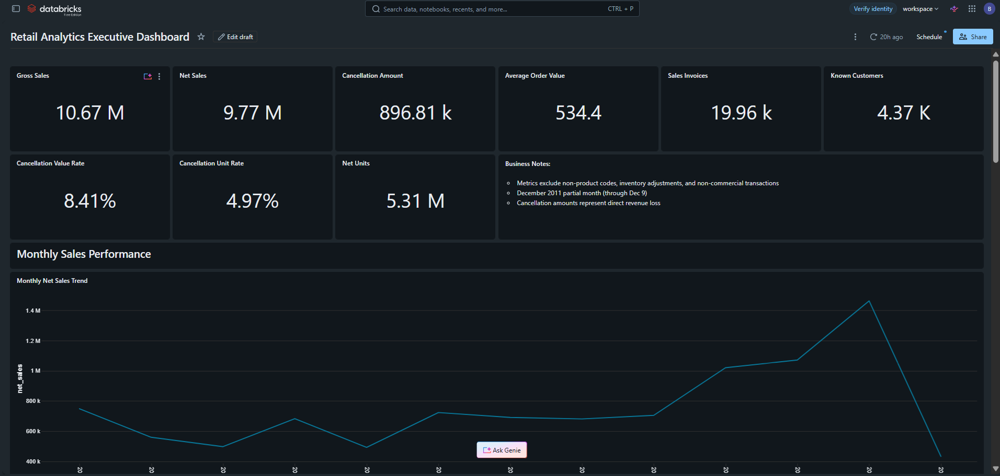
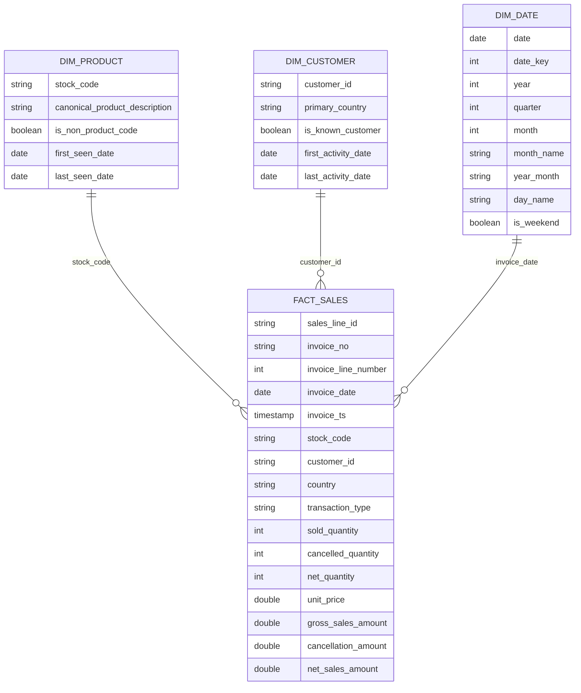
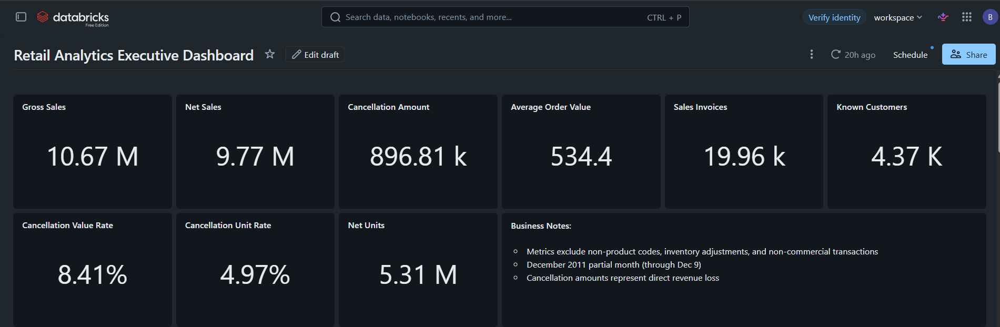
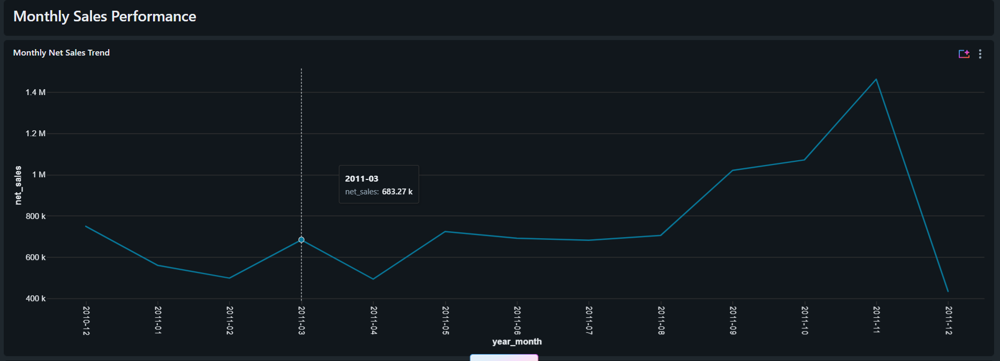
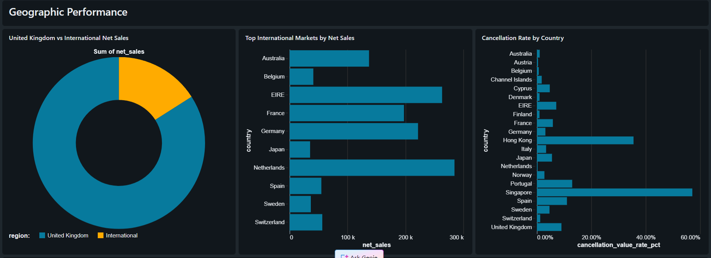
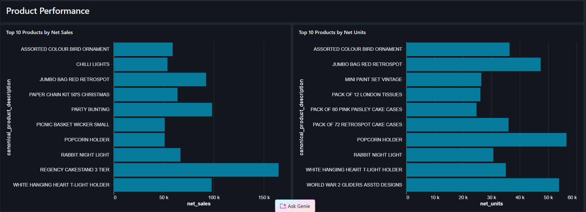
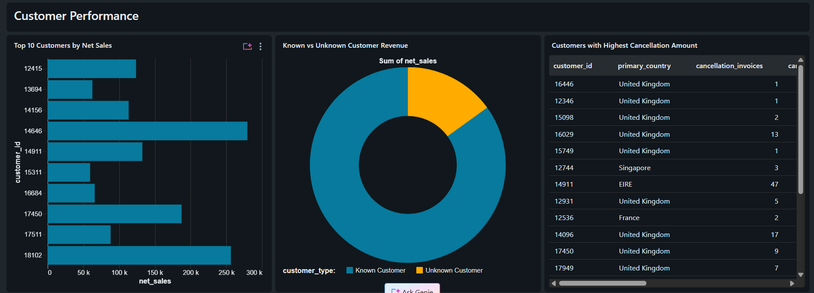
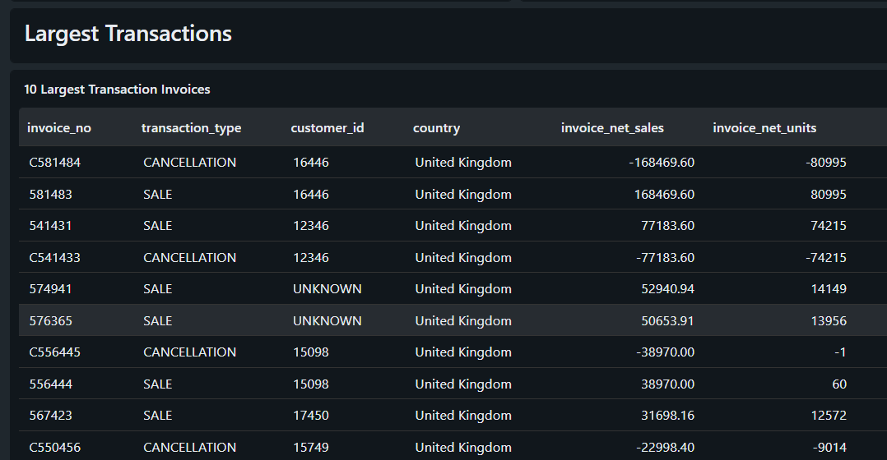
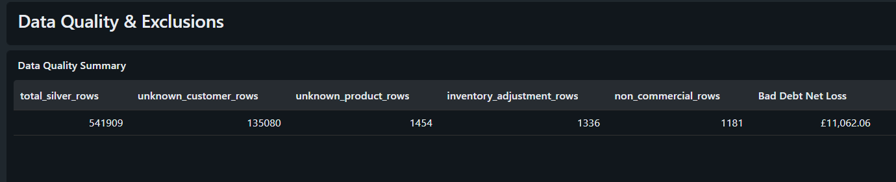

# Databricks SQL Retail Analytics Dashboard

End-to-end retail analytics project built with **Databricks**, **PySpark**, **Spark SQL**, **Delta Lake**, **Medallion Architecture**, **dimensional modeling**, **data quality validation**, and a published **Databricks SQL executive dashboard**.

This project processes the UCI Online Retail dataset through Bronze, Silver, and Gold layers, builds a reusable star schema, calculates business KPIs, validates the analytical model, and presents the results in an executive dashboard.

---

## Dashboard Preview



---

## Project Overview

Retail transaction datasets often contain more than valid sales. They may include cancellations, missing customers, missing product descriptions, inventory adjustments, bad debt records, service charges, and incomplete reporting periods.

The goal of this project is to transform raw retail transactions into a reliable analytical model that supports business reporting while preserving traceability and data quality visibility.

The final solution provides analysis of:

- Gross and net sales
- Cancellation impact
- Average order value
- Monthly sales trends
- Geographic performance
- Product performance
- Customer performance
- Exceptional transactions
- Data quality indicators

---

## Business Problem

The source dataset contains more than 500,000 retail transaction lines, but the raw records cannot be used directly for executive reporting.

The main challenges were:

1. Distinguishing valid sales from cancellations and operational adjustments.
2. Preserving records with missing customer or product information.
3. Preventing non-product business codes from appearing in product rankings.
4. Separating gross sales, cancellation amounts, and net sales.
5. Building a reusable analytical model for SQL queries and dashboards.
6. Validating that commercial rows and financial values remain consistent between layers.
7. Presenting business insights in a clear executive dashboard.

---

## Solution Architecture

The project follows the Medallion Architecture pattern:

```text
UCI Online Retail Dataset
        |
        v
Bronze Delta Layer
Raw records and source metadata
        |
        v
Silver Delta Layer
Cleaned, standardized, classified transactions
        |
        v
Gold Analytics Layer
Star schema and quality summary
        |
        v
Databricks SQL
Business KPIs, dashboard queries, validations
        |
        v
Executive Retail Analytics Dashboard
```

A detailed architecture explanation is available in:

[docs/architecture.md](docs/architecture.md)

---

## Technology Stack

- Databricks
- Apache Spark
- PySpark
- Spark SQL
- Delta Lake
- Databricks SQL
- Databricks AI/BI Dashboards
- Genie Code
- Python
- Pandas
- Git
- GitHub

---

## Dataset

The project uses the **UCI Online Retail** dataset.

The dataset contains transactions from a United Kingdom-based non-store online retailer.

Dataset period:

```text
2010-12-01 to 2011-12-09
```

Main source fields:

| Column | Description |
|---|---|
| `InvoiceNo` | Invoice identifier |
| `StockCode` | Product or business code |
| `Description` | Product description |
| `Quantity` | Transaction quantity |
| `InvoiceDate` | Invoice timestamp |
| `UnitPrice` | Product unit price |
| `CustomerID` | Customer identifier |
| `Country` | Transaction country |

Initial record count:

```text
541,909 rows
```

Important source quality findings:

| Data quality condition | Rows |
|---|---:|
| Missing customer identifier | 135,080 |
| Missing product description | 1,454 |
| Non-positive quantity | 10,624 |
| Non-positive unit price | 2,517 |
| Cancellation lines | 9,288 |

---

## Repository Structure

```text
databricks-sql-retail-analytics-dashboard/
├── notebooks/
│   ├── 01_ingest_online_retail_bronze
│   ├── 02_build_silver_retail_sales_clean
│   └── 03_build_gold_analytics_model
│
├── sql/
│   ├── 01_business_kpis.sql
│   ├── 02_dashboard_queries.sql
│   └── 03_validation_queries.sql
│
├── images/
│   ├── 01_dashboard_overview.png
│   ├── 02_executive_kpis.png
│   ├── 03_monthly_sales_trend.png
│   ├── 04_geographic_performance.png
│   ├── 05_product_performance.png
│   ├── 06_customer_performance.png
│   ├── 07_largest_transactions.png
│   └── 08_data_quality_summary.png
│
├── docs/
│   └── architecture.md
│
├── README.md
└── LICENSE
```

---

# Data Pipeline

## Bronze Layer

Target table:

```text
retail_analytics_project.bronze_online_retail_raw
```

The Bronze layer preserves the source data with minimal transformation.

Main responsibilities:

- Download and extract the source Excel file
- Read the dataset with Pandas
- Normalize incompatible Pandas values before Spark conversion
- Apply an explicit Spark schema
- Convert invoice dates to timestamps
- Preserve identifiers as strings
- Add source metadata
- Write the data as a Delta table

Additional metadata fields:

- `source_system`
- `source_file`
- `source_url`
- `bronze_ingestion_ts`

Bronze record count:

```text
541,909
```

---

## Silver Layer

Target table:

```text
retail_analytics_project.silver_retail_sales_clean
```

The Silver layer cleans, classifies, and enriches every source record without silently removing data.

### Standardized columns

| Source column | Silver column |
|---|---|
| `InvoiceNo` | `invoice_no` |
| `StockCode` | `stock_code` |
| `Description` | `product_description` |
| `Quantity` | `quantity` |
| `InvoiceDate` | `invoice_ts` |
| `UnitPrice` | `unit_price` |
| `CustomerID` | `customer_id` |
| `Country` | `country` |

### Missing value handling

Missing customers are represented as:

```text
UNKNOWN
```

Missing product descriptions are represented as:

```text
UNKNOWN PRODUCT
```

This approach preserves rows and prevents null keys in the analytical model.

### Transaction classification

Each row is classified into one of four transaction types:

| Transaction type | Rows | Business meaning |
|---|---:|---|
| `SALE` | 530,104 | Positive commercial sale |
| `CANCELLATION` | 9,288 | Invoice beginning with `C` |
| `RETURN_OR_ADJUSTMENT` | 1,336 | Negative quantity with zero price |
| `INVALID_OR_NON_COMMERCIAL` | 1,181 | Administrative or non-commercial record |

Total:

```text
541,909 rows
```

### Silver quality flags

The Silver table includes reusable quality and business flags:

- `is_customer_known`
- `is_cancellation`
- `has_positive_quantity`
- `has_positive_unit_price`
- `is_product_description_known`
- `is_valid_sales_line`

### Silver calculated amounts

The Silver table includes three main monetary fields:

| Field | Description |
|---|---|
| `signed_line_amount` | Quantity multiplied by unit price, preserving the sign |
| `gross_sales_amount` | Positive sales amount for valid sales lines |
| `cancellation_amount` | Absolute value of cancelled transaction amount |

All monetary values are rounded to two decimal places.

### Silver business interpretation

`RETURN_OR_ADJUSTMENT` records were found to have:

```text
unit_price = 0
```

These rows represent inventory or operational adjustments, not monetary returns.

`INVALID_OR_NON_COMMERCIAL` includes administrative or financial records such as bad debt adjustments. These records are retained for traceability but excluded from core commercial revenue KPIs.

---

## Gold Layer

The Gold layer provides a dimensional analytics model optimized for SQL queries and dashboard consumption.

### Fact table

Target table:

```text
retail_analytics_project.fact_sales
```

Grain:

> One row represents one commercial product line within a sales or cancellation invoice.

Included transaction types:

- `SALE`
- `CANCELLATION`

Excluded from the commercial fact table:

- `RETURN_OR_ADJUSTMENT`
- `INVALID_OR_NON_COMMERCIAL`

Fact table record count:

```text
539,392
```

Main measures:

- `sold_quantity`
- `cancelled_quantity`
- `net_quantity`
- `gross_sales_amount`
- `cancellation_amount`
- `net_sales_amount`

Formula:

```text
Net Sales = Gross Sales - Cancellation Amount
```

### Product dimension

Target table:

```text
retail_analytics_project.dim_product
```

Record count:

```text
3,958
```

The product dimension selects the most frequently used description for each `stock_code` as the canonical product description.

It also flags non-product business codes, including:

- `POST`
- `DOT`
- `D`
- `M`
- `AMAZONFEE`
- `BANK CHARGES`
- `B`

These codes represent postage, fees, discounts, manual adjustments, bank charges, or bad debt. They are excluded from product rankings.

### Customer dimension

Target table:

```text
retail_analytics_project.dim_customer
```

Record count:

```text
4,373
```

This includes:

```text
4,372 identified customers
1 UNKNOWN customer member
```

The `UNKNOWN` member preserves anonymous revenue without creating null customer relationships.

### Date dimension

Target table:

```text
retail_analytics_project.dim_date
```

Record count:

```text
374
```

The date dimension contains every calendar day from:

```text
2010-12-01 to 2011-12-09
```

Attributes include:

- `date_key`
- `year`
- `quarter`
- `month`
- `month_name`
- `year_month`
- `day_of_month`
- `day_of_week_number`
- `day_name`
- `week_of_year`
- `is_weekend`

### Data quality summary

Target table:

```text
retail_analytics_project.gold_data_quality_summary
```

This one-row snapshot exposes:

- Total Silver rows
- Unknown customer rows
- Unknown product rows
- Sale rows
- Cancellation rows
- Inventory adjustment rows
- Non-commercial rows
- Bad debt net loss
- Gold processing timestamp

---

## Star Schema



---

# Business KPIs

Validated executive metrics:

| KPI | Result |
|---|---:|
| Gross Sales | £10,666,684.54 |
| Cancellation Amount | £896,812.49 |
| Net Sales | £9,769,872.05 |
| Sales Invoices | 19,960 |
| Known Customers | 4,371 |
| Average Order Value | £534.40 |
| Sold Units | 5,588,376 |
| Cancelled Units | 277,574 |
| Net Units | 5,310,802 |
| Cancellation Value Rate | 8.41% |
| Cancellation Unit Rate | 4.97% |
| Cancellation Line Rate | 1.72% |
| Bad Debt Net Loss | £11,062.06 |

Average Order Value is calculated only from `SALE` invoices:

```text
Average Order Value =
Average gross value of distinct SALE invoices
```

Cancellation value rate:

```text
Cancellation Amount / Gross Sales × 100
```

Cancellation unit rate:

```text
Cancelled Units / Sold Units × 100
```

---

# Dashboard

The Databricks SQL dashboard includes:

- Executive KPI cards
- Monthly sales trend
- United Kingdom vs international revenue
- Top international markets
- Cancellation rate by country
- Top products by net sales
- Top products by net units
- Top customers by net sales
- Known vs unknown customer revenue
- Customers with the highest cancellation amounts
- Largest commercial transactions
- Gold data quality indicators

## Executive KPIs



## Monthly Sales Trend



## Geographic Performance



## Product Performance



## Customer Performance



## Largest Transactions



## Data Quality Summary



---

# Main Business Insights

## United Kingdom market concentration

United Kingdom generated approximately:

```text
£8.21M in Net Sales
```

This represents approximately 84% of total net sales.

International markets generated approximately:

```text
£1.56M in Net Sales
```

The strongest international markets were:

1. Netherlands
2. EIRE
3. Germany
4. France
5. Australia

---

## Strong year-end seasonality

The strongest full month was:

```text
November 2011
Net Sales: £1,461,756.25
```

Sales increased significantly during September, October, and November 2011.

December 2011 is a partial month and contains data only through December 9. It should not be compared directly with full months.

---

## Revenue and volume leaders differ

The top product by net sales was:

```text
REGENCY CAKESTAND 3 TIER
```

The highest-volume products included lower-priced items such as:

```text
POPCORN HOLDER
WORLD WAR 2 GLIDERS ASSTD DESIGNS
JUMBO BAG RED RETROSPOT
```

This confirms that the top products by revenue are not necessarily the same as the top products by units.

---

## Customer concentration

The highest-value identified customer was:

```text
Customer 14646
Primary Country: Netherlands
Net Sales: £279,489.02
```

A relatively small number of customers generated a significant share of total sales.

---

## Unknown customer activity

Unknown customers generated approximately:

```text
£1.47M in Net Sales
```

This represents approximately 15% of total net sales.

Although unknown customers represent a large number of transaction lines, their revenue share is lower, indicating smaller average transaction values.

---

## Cancellation behavior

Cancellation activity represented:

```text
8.41% of Gross Sales
4.97% of Sold Units
1.72% of Commercial Lines
```

The difference between these rates indicates that a small number of high-value or high-volume cancellations had a disproportionate financial impact.

Two exceptional sales were almost completely cancelled:

```text
Invoice 581483 / C581484
£168,469.60
80,995 units

Invoice 541431 / C541433
£77,183.60
74,215 units
```

These records were retained because they have matching sale and cancellation activity and are not isolated calculation errors.

---

# Data Validation

The project includes SQL validations for:

- Silver-to-Gold record reconciliation
- Monetary reconciliation
- Net sales formula validation
- Net quantity formula validation
- Duplicate `sales_line_id` checks
- Missing key checks
- Dimension key uniqueness
- Referential integrity
- Date continuity
- Unknown customer member validation
- Non-product business code validation
- Gold table count validation
- Data quality summary validation

Validated results:

```text
Silver commercial rows = Gold fact rows
Row difference = 0

Gross sales difference = 0
Cancellation difference = 0

Invalid net sales rows = 0
Invalid net quantity rows = 0

Fact rows without product = 0
Fact rows without customer = 0
Fact rows without date = 0

Date continuity = PASS
Quality summary rows = 1
```

---

# How to Run the Project

## Prerequisites

- Databricks workspace
- Spark compute or serverless notebook environment
- Databricks SQL Warehouse
- Permission to create schemas and Delta tables

## Execution order

Run the notebooks in this order:

```text
1. notebooks/01_ingest_online_retail_bronze
2. notebooks/02_build_silver_retail_sales_clean
3. notebooks/03_build_gold_analytics_model
```

Then execute the SQL files:

```text
1. sql/01_business_kpis.sql
2. sql/02_dashboard_queries.sql
3. sql/03_validation_queries.sql
```

Finally:

1. Connect the dashboard datasets to the Gold tables.
2. Create the dashboard visualizations.
3. Validate KPI results.
4. Publish the Databricks dashboard.

---

# Design Decisions

## Preserve rather than silently delete

Rows with missing customers, missing descriptions, inventory adjustments, or non-commercial activity remain available for traceability.

## Separate operational and commercial activity

Inventory adjustments and non-commercial records are excluded from core sales KPIs but remain visible in the quality summary.

## Use an unknown dimension member

Missing customers are mapped to:

```text
UNKNOWN
```

This prevents null dimension relationships and preserves anonymous revenue.

## Use canonical product descriptions

The most frequently observed description is selected for each product code instead of selecting an arbitrary duplicate.

## Exclude service codes from product rankings

Postage, fees, discounts, bad debt, bank charges, and manual adjustments are not treated as products.

## Build a continuous date dimension

Every day in the source range is represented, including dates without sales activity.

---

# Limitations

- The dataset ends on December 9, 2011, so the final month is incomplete.
- Customer identifiers are missing for approximately 25% of source rows.
- Monetary fields use Spark `DOUBLE` values with explicit two-decimal rounding. A production financial model would normally use `DECIMAL`.
- The source does not provide an official invoice line identifier. A technical `sales_line_id` is derived within each invoice.
- Some cancellations may reference sales outside the available dataset period.
- Product categories are not available in the source and were not inferred.
- The published Databricks dashboard may require authentication and workspace access.

---

# Future Improvements

Possible future extensions include:

- Customer RFM segmentation
- Cohort analysis
- Customer lifetime value
- Product affinity analysis
- Sales forecasting
- Anomaly detection
- Incremental ingestion
- Delta `MERGE` processing
- Scheduled Databricks Workflows
- Historical data quality snapshots
- Automated pipeline audit logging
- Semantic metric definitions
- Production-grade `DECIMAL` monetary fields

---

# Skills Demonstrated

- Medallion Architecture
- Data ingestion
- PySpark transformations
- Explicit schema management
- Delta Lake tables
- Data profiling
- Data cleaning
- Transaction classification
- Data quality flags
- Star schema design
- Fact and dimension modeling
- Window functions
- Canonical dimension attributes
- Business KPI development
- Databricks SQL
- Dashboard design
- Data reconciliation
- Referential integrity testing
- Git and GitHub documentation

---

# Author

**Brayan Perez Balladares**

Aspiring Data Engineer focused on Databricks, PySpark, Spark SQL, Delta Lake, data modeling, ETL/ELT, pipeline validation, and analytics engineering.

- GitHub: [BrayanperezBalladares](https://github.com/BrayanperezBalladares)