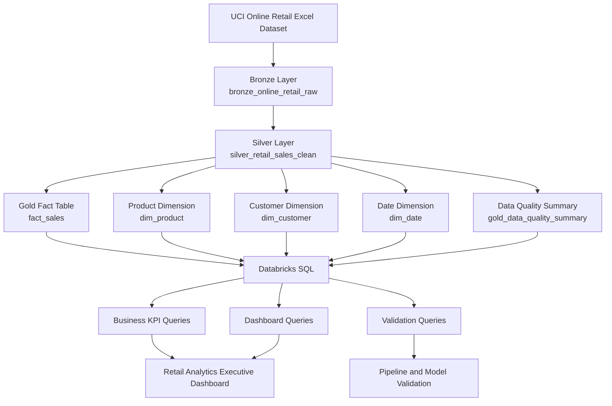
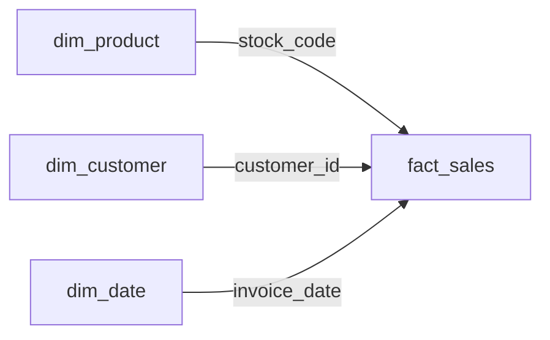
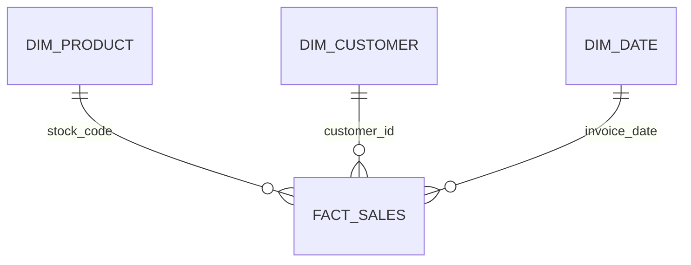
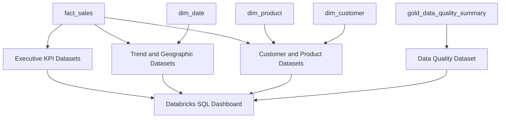

# Project Architecture

## Databricks SQL Retail Analytics Dashboard

This document describes the technical architecture, data flow, modeling decisions, transformation rules, validation strategy, and dashboard layer used in the **Databricks SQL Retail Analytics Dashboard** project.

The project transforms the UCI Online Retail dataset into a validated analytical solution using Databricks, PySpark, Spark SQL, Delta Lake, Medallion Architecture, dimensional modeling, and Databricks SQL dashboards.

---

## 1. Architecture Goals

The architecture was designed to:

- Preserve the original source data.
- Provide traceability across all transformation layers.
- Separate raw, cleaned, and analytical responsibilities.
- Classify sales, cancellations, inventory adjustments, and non-commercial records.
- Build a reusable Gold layer for business analytics.
- Support SQL-based KPIs and dashboard visualizations.
- Expose data quality conditions instead of hiding them.
- Validate row counts, financial amounts, formulas, dimensions, and referential integrity.

---

## 2. High-Level Architecture



---

## 3. Data Source

The source is the **UCI Online Retail** dataset, provided in Excel format.

The dataset contains transactions from a United Kingdom-based non-store online retailer.

Source date range:

```text
2010-12-01 to 2011-12-09
```

Initial source row count:

```text
541,909 rows
```

Main source fields:

| Source column | Description |
|---|---|
| `InvoiceNo` | Invoice identifier |
| `StockCode` | Product or business code |
| `Description` | Product description |
| `Quantity` | Transaction quantity |
| `InvoiceDate` | Invoice timestamp |
| `UnitPrice` | Unit price |
| `CustomerID` | Customer identifier |
| `Country` | Transaction country |

Important source quality findings:

| Data quality condition | Rows |
|---|---:|
| Missing customer identifier | 135,080 |
| Missing product description | 1,454 |
| Non-positive quantity | 10,624 |
| Non-positive unit price | 2,517 |
| Cancellation lines | 9,288 |

---

## 4. Medallion Architecture

The pipeline follows the Medallion Architecture pattern:

```text
Bronze → Silver → Gold
```

Each layer has a specific responsibility.

| Layer | Purpose |
|---|---|
| Bronze | Preserve source data with metadata |
| Silver | Clean, standardize, classify, and enrich transactions |
| Gold | Build dimensional model, KPIs, and quality summary |

---

# 5. Bronze Layer

## Table

```text
retail_analytics_project.bronze_online_retail_raw
```

## Purpose

The Bronze layer preserves the original dataset with minimal transformation.

Its role is not to decide whether a transaction is valid or invalid. Instead, it provides a reliable and traceable copy of the source data.

## Responsibilities

- Download the source ZIP file.
- Extract the Excel file.
- Read the dataset using Pandas.
- Handle Pandas-to-Spark compatibility issues.
- Apply an explicit Spark schema.
- Convert invoice timestamps safely.
- Store business identifiers as strings.
- Add source metadata.
- Persist the result as a Delta table.

## Bronze Schema

```text
InvoiceNo              string
StockCode              string
Description            string
Quantity               integer
InvoiceDate            timestamp
UnitPrice              double
CustomerID             string
Country                string
source_system          string
source_file            string
source_url             string
bronze_ingestion_ts    timestamp
```

## Metadata Fields

The following fields provide source lineage:

- `source_system`
- `source_file`
- `source_url`
- `bronze_ingestion_ts`

## Bronze Validation

Expected Bronze row count:

```text
541,909
```

No business records are intentionally removed in this layer.

---

# 6. Silver Layer

## Table

```text
retail_analytics_project.silver_retail_sales_clean
```

## Purpose

The Silver layer creates a cleaned, standardized, classified, and reusable transaction dataset.

It preserves all Bronze records while adding business meaning, quality flags, and calculated amounts.

## Standardized Fields

| Bronze field | Silver field |
|---|---|
| `InvoiceNo` | `invoice_no` |
| `StockCode` | `stock_code` |
| `Description` | `product_description` |
| `Quantity` | `quantity` |
| `InvoiceDate` | `invoice_ts` |
| `UnitPrice` | `unit_price` |
| `CustomerID` | `customer_id` |
| `Country` | `country` |

## Explicit Type Enforcement

Important fields are explicitly cast to avoid calculation errors:

```text
quantity      integer
unit_price    double
invoice_ts    timestamp
```

Business identifiers are stored as strings:

```text
invoice_no     string
stock_code     string
customer_id    string
```

This avoids treating identifiers as numeric measures.

---

## 7. Missing Value Strategy

### Unknown Customer

Missing or blank customer IDs are mapped to:

```text
UNKNOWN
```

### Unknown Product

Missing or blank product descriptions are mapped to:

```text
UNKNOWN PRODUCT
```

### Unknown Country

Missing or blank countries are mapped to:

```text
UNKNOWN
```

This approach preserves records instead of deleting them.

It also prevents null keys from breaking downstream joins in the Gold model.

---

## 8. Transaction Classification

Each row in Silver is classified into one of four transaction types.

| Transaction type | Rows | Business interpretation |
|---|---:|---|
| `SALE` | 530,104 | Valid positive commercial sale |
| `CANCELLATION` | 9,288 | Invoice number begins with `C` |
| `RETURN_OR_ADJUSTMENT` | 1,336 | Negative quantity without cancellation invoice |
| `INVALID_OR_NON_COMMERCIAL` | 1,181 | Administrative, incomplete, or non-commercial record |

Total:

```text
541,909 rows
```

This confirms that every source row receives a classification.

---

## 9. Classification Rules

### SALE

A row is classified as `SALE` when:

```text
invoice_no does not start with C
quantity > 0
unit_price > 0
```

### CANCELLATION

A row is classified as `CANCELLATION` when:

```text
invoice_no starts with C
```

### RETURN_OR_ADJUSTMENT

A row is classified as `RETURN_OR_ADJUSTMENT` when:

```text
quantity < 0
invoice_no does not start with C
```

All rows in this category were confirmed to have:

```text
unit_price = 0
```

These records are interpreted as operational or inventory adjustments.

### INVALID_OR_NON_COMMERCIAL

Rows that do not match the commercial rules are classified as `INVALID_OR_NON_COMMERCIAL`.

This group includes administrative or financial records such as bad debt adjustments.

Example:

```text
stock_code = B
product_description = Adjust bad debt
```

---

## 10. Silver Quality Flags

The Silver layer includes reusable quality and business flags:

```text
is_customer_known
is_cancellation
has_positive_quantity
has_positive_unit_price
is_product_description_known
is_valid_sales_line
```

These flags make the transformation logic transparent and reusable.

Instead of forcing analysts to recreate business rules in every query, the rules are centralized in the Silver layer.

---

## 11. Silver Measures

### Signed Line Amount

```text
signed_line_amount = quantity × unit_price
```

This preserves the original sign.

### Gross Sales Amount

```text
gross_sales_amount =
quantity × unit_price for valid SALE records
otherwise 0
```

### Cancellation Amount

```text
cancellation_amount =
absolute value of quantity × unit_price for CANCELLATION records
otherwise 0
```

All monetary values are rounded to two decimal places.

---

## 12. Silver Output Summary

Final Silver classification:

| Transaction type | Rows | Signed amount | Gross sales | Cancellation amount |
|---|---:|---:|---:|---:|
| `SALE` | 530,104 | 10,666,684.54 | 10,666,684.54 | 0 |
| `CANCELLATION` | 9,288 | -896,812.49 | 0 | 896,812.49 |
| `RETURN_OR_ADJUSTMENT` | 1,336 | 0 | 0 | 0 |
| `INVALID_OR_NON_COMMERCIAL` | 1,181 | -22,124.12 | 0 | 0 |

Silver record count:

```text
541,909
```

---

# 13. Gold Analytics Layer

## Purpose

The Gold layer exposes an analytical model optimized for SQL queries and dashboard consumption.

It transforms the cleaned Silver table into a star schema.

The Gold layer supports:

- Executive KPIs
- Product analysis
- Customer analysis
- Geographic analysis
- Time-based analysis
- Cancellation analysis
- Data quality monitoring

---

## 14. Gold Star Schema



Relational view:



---

# 15. Fact Table

## Table

```text
retail_analytics_project.fact_sales
```

## Grain

The grain of the fact table is:

> One row represents one commercial invoice line for one product.

This means one invoice can have multiple rows in `fact_sales`.

Example:

```text
Invoice 536365
    ├── Product line 1
    ├── Product line 2
    └── Product line 3
```

## Included Transaction Types

The fact table includes:

- `SALE`
- `CANCELLATION`

## Excluded Transaction Types

The fact table excludes:

- `RETURN_OR_ADJUSTMENT`
- `INVALID_OR_NON_COMMERCIAL`

These records remain available in Silver and in the Gold quality summary.

## Record Count

```text
539,392
```

Reconciliation:

```text
530,104 SALE rows
+ 9,288 CANCELLATION rows
= 539,392 fact rows
```

## Technical Identifiers

The source does not provide an official invoice line ID.

A technical line number is generated within each invoice, and then a `sales_line_id` is created.

Example:

```text
536365-0001
536365-0002
536365-0003
```

## Fact Measures

```text
sold_quantity
cancelled_quantity
net_quantity
gross_sales_amount
cancellation_amount
net_sales_amount
```

Formulas:

```text
Net Quantity = Sold Quantity - Cancelled Quantity
```

```text
Net Sales = Gross Sales - Cancellation Amount
```

Validated totals:

```text
Gross Sales:          £10,666,684.54
Cancellation Amount:    £896,812.49
Net Sales:             £9,769,872.05
```

---

# 16. Product Dimension

## Table

```text
retail_analytics_project.dim_product
```

## Record Count

```text
3,958
```

## Purpose

The product dimension provides product-level context for the fact table.

## Canonical Product Description

The same `stock_code` can appear with different descriptions.

Instead of keeping an arbitrary duplicate, the model selects the most frequently observed description as:

```text
canonical_product_description
```

This creates a stable product label for analytics and dashboards.

## Non-Product Business Codes

Some `stock_code` values are not physical products.

The following codes are marked as:

```text
is_non_product_code = true
```

Codes:

```text
POST
DOT
D
M
AMAZONFEE
BANK CHARGES
B
```

These represent:

- Postage
- Dotcom postage
- Discounts
- Manual adjustments
- Amazon fees
- Bank charges
- Bad debt

These codes are excluded from product rankings.

---

# 17. Customer Dimension

## Table

```text
retail_analytics_project.dim_customer
```

## Record Count

```text
4,373
```

This includes:

```text
4,372 identified customers
1 UNKNOWN customer member
```

## Unknown Customer Strategy

Missing customer IDs are mapped to:

```text
UNKNOWN
```

This strategy ensures that:

- Anonymous sales are preserved.
- Fact table joins remain complete.
- Unknown customer revenue can still be analyzed.
- Customer rankings can exclude unknown customers when needed.

## Primary Country

A customer can appear in more than one country.

The dimension selects the most frequently observed country as:

```text
primary_country
```

---

# 18. Date Dimension

## Table

```text
retail_analytics_project.dim_date
```

## Record Count

```text
374
```

## Date Range

```text
2010-12-01 to 2011-12-09
```

## Purpose

The date dimension provides a continuous calendar for time-based analysis.

It includes every calendar day in the source range, even days without sales.

## Attributes

```text
date
date_key
year
quarter
month
month_name
year_month
day_of_month
day_of_week_number
day_name
week_of_year
is_weekend
```

A continuous date dimension supports:

- Monthly trends
- Weekday analysis
- Weekend analysis
- Chronological sorting
- Time-series dashboard visuals

---

# 19. Gold Data Quality Summary

## Table

```text
retail_analytics_project.gold_data_quality_summary
```

## Grain

One row representing the latest quality snapshot.

## Metrics

The table contains:

- `total_silver_rows`
- `unknown_customer_rows`
- `unknown_product_rows`
- `sale_rows`
- `cancellation_rows`
- `inventory_adjustment_rows`
- `non_commercial_rows`
- `bad_debt_net_loss_amount`
- `gold_processed_ts`

## Bad Debt Net Loss

Bad debt is calculated using records where:

```text
stock_code = B
```

The selected metric uses the net signed impact:

```text
ABS(SUM(signed_line_amount))
```

Validated value:

```text
£11,062.06
```

This represents the final net bad debt loss, not the sum of absolute activity across all bad-debt records.

---

# 20. SQL Analytics Layer

The SQL layer is separated into three files.

## Business KPI Queries

```text
sql/01_business_kpis.sql
```

Contains:

- Revenue overview
- Complete business KPI summary
- Average Order Value
- Cancellation value rate
- Cancellation unit rate
- Cancellation line rate
- Summary by transaction type

## Dashboard Queries

```text
sql/02_dashboard_queries.sql
```

Contains:

- Monthly sales trend
- Day-of-week performance
- Weekday vs weekend
- Sales by country
- United Kingdom vs international market
- Top international markets
- Top products by net sales
- Top products by net units
- Top customers by net sales
- Known vs unknown customer revenue
- Largest commercial transactions
- Cancellation rate by country
- Customers with highest cancellation amount
- Gold data quality overview

## Validation Queries

```text
sql/03_validation_queries.sql
```

Contains:

- Silver row count by transaction type
- Silver-to-Gold row reconciliation
- Excluded transaction reconciliation
- Monetary reconciliation
- Net sales formula validation
- Net quantity formula validation
- Duplicate `sales_line_id` checks
- Missing key checks
- Referential integrity validation
- Dimension uniqueness validation
- Date continuity validation
- Transaction measure validation
- Unknown customer validation
- Non-product code validation
- Gold table count validation
- Quality summary validation

---

# 21. Dashboard Architecture



The dashboard includes:

1. Executive KPIs
2. Monthly Sales Performance
3. Geographic Performance
4. Product Performance
5. Customer Performance
6. Exceptional Transactions
7. Data Quality Summary

---

# 22. Validated Business Metrics

| Metric | Value |
|---|---:|
| Gross Sales | £10,666,684.54 |
| Cancellation Amount | £896,812.49 |
| Net Sales | £9,769,872.05 |
| Sales Invoices | 19,960 |
| Known Customers | 4,371 |
| Average Order Value | £534.40 |
| Sold Units | 5,588,376 |
| Cancelled Units | 277,574 |
| Net Units | 5,310,802 |
| Cancellation Value Rate | 8.41% |
| Cancellation Unit Rate | 4.97% |
| Cancellation Line Rate | 1.72% |
| Bad Debt Net Loss | £11,062.06 |

---

# 23. Validation Strategy

The project validates the analytical model at several levels.

## Row Count Validation

```text
Silver commercial rows = fact_sales rows
539,392 = 539,392
```

## Monetary Validation

```text
Silver Gross Sales = Gold Gross Sales
Silver Cancellation Amount = Gold Cancellation Amount
```

Expected difference:

```text
0
```

## Formula Validation

Expected invalid rows:

```text
Invalid Net Sales formula rows = 0
Invalid Net Quantity formula rows = 0
```

## Referential Integrity

Expected orphan fact rows:

```text
Fact rows without product = 0
Fact rows without customer = 0
Fact rows without date = 0
```

## Dimension Key Uniqueness

Expected duplicate keys:

```text
dim_product duplicate keys = 0
dim_customer duplicate keys = 0
dim_date duplicate keys = 0
```

## Date Continuity

Expected result:

```text
374 actual days
374 expected days
PASS
```

## Quality Summary

Expected result:

```text
quality_summary_rows = 1
validation_status = PASS
```

---

# 24. Important Business Rules

1. Sales and cancellations are included in commercial reporting.
2. Inventory adjustments are not treated as revenue.
3. Non-commercial financial records are excluded from sales KPIs.
4. Missing customers are represented through `UNKNOWN`.
5. Unknown customers are excluded from individual customer rankings.
6. Unknown customer revenue remains included in total revenue.
7. Non-product business codes are excluded from product rankings.
8. Average Order Value uses only `SALE` invoices.
9. Monthly values are sorted chronologically using `year_month`.
10. December 2011 is documented as a partial month.
11. Countries with low gross sales can be excluded from cancellation-rate comparisons using a minimum gross sales threshold.
12. Exceptional transactions are retained and displayed instead of being automatically removed.

---

# 25. Key Business Findings

## United Kingdom Concentration

United Kingdom generated approximately:

```text
£8.21M in Net Sales
```

This represents around 84% of total net sales.

International markets generated approximately:

```text
£1.56M in Net Sales
```

## Strongest Full Month

The strongest full month was:

```text
November 2011
Net Sales: £1,461,756.25
```

December 2011 is incomplete because the dataset only contains data through December 9.

## Product Performance

Top products by revenue and top products by units are not the same.

This shows the difference between:

```text
High-value products
High-volume products
```

## Customer Concentration

The top customer by net sales was:

```text
Customer 14646
Primary Country: Netherlands
Net Sales: £279,489.02
```

## Unknown Customer Revenue

Unknown customers generated approximately:

```text
£1.47M in Net Sales
```

This represents around 15% of total net sales.

## Cancellation Impact

Cancellation activity represented:

```text
8.41% of Gross Sales
4.97% of Sold Units
1.72% of Commercial Lines
```

This shows that a small number of high-value or high-volume cancellations had a disproportionate financial impact.

---

# 26. Architectural Limitations

- The source contains no official invoice line identifier.
- The final source month is incomplete.
- Monetary columns use `DOUBLE` with explicit rounding.
- A production financial model would normally use `DECIMAL`.
- Product categories are not available in the source.
- Some cancellations may reference purchases outside the available period.
- Missing customers prevent complete customer-level attribution.
- The current pipeline performs full table overwrites rather than incremental processing.
- The quality summary represents the latest snapshot rather than historical trends.

---

# 27. Future Architecture Improvements

Possible production-oriented improvements include:

- Incremental ingestion
- Delta `MERGE`
- Databricks Workflows
- Pipeline audit table
- Historical quality snapshots
- Schema evolution controls
- Expectation-based data quality checks
- `DECIMAL` monetary columns
- Slowly changing dimensions
- Customer segmentation
- Product categorization
- Forecasting
- Anomaly detection
- Automated dashboard refresh

---

# 28. Final Architecture Summary

The project transforms an imperfect operational retail dataset into a validated analytical solution through:

```text
Raw ingestion
    ↓
Standardized Silver transactions
    ↓
Commercial and non-commercial classification
    ↓
Gold dimensional model
    ↓
Reusable SQL metrics
    ↓
Validation controls
    ↓
Executive dashboard
```

The architecture preserves traceability while providing clear business metrics and a reusable foundation for future retail analytics.
